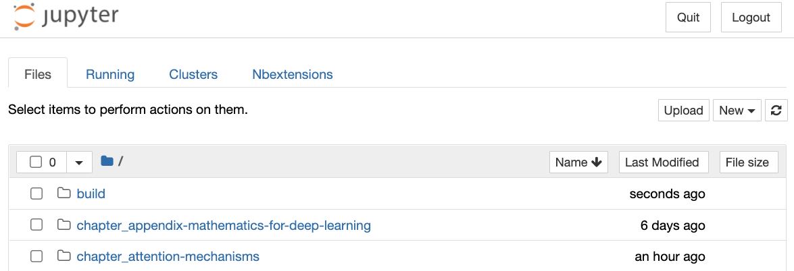
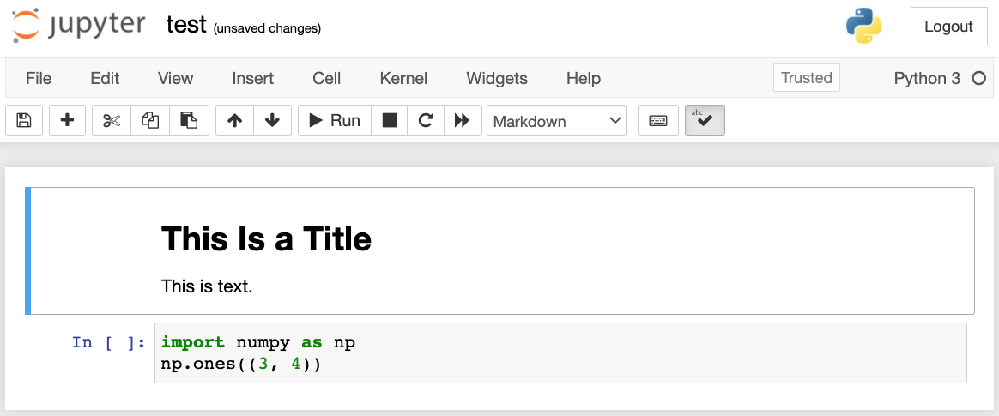
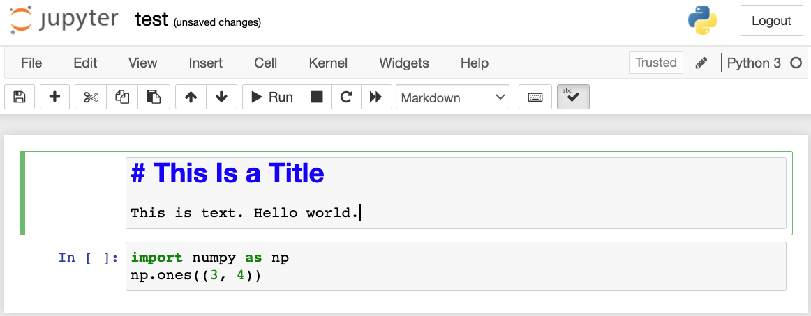
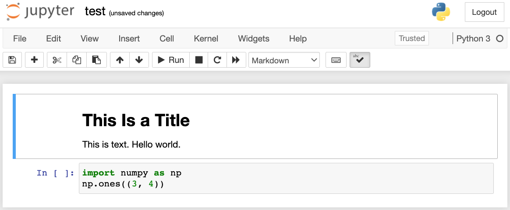
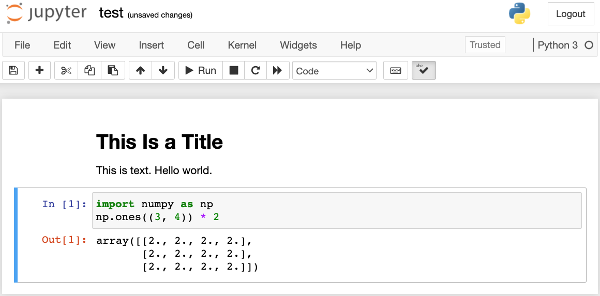

# 使用 Jupyter
:label:`sec_jupyter`

本节介绍如何使用 Jupyter Notebook 编辑和运行本书章节中的代码。确保按照 :ref:`chap_installation` 中的描述安装了 Jupyter 并下载了该代码。如果你想了解更多关于 Jupyter 的信息，请参阅他们的 [Documentation](https://jupyter.readthedocs.io/en/latest/) 中的优秀教程。 

## 在本地编辑和运行代码

假设这本书的本地代码路径是 “xx/yy/d2l-en/”。使用命令行管理程序将目录更改为此路径 (`cd xx/yy/d2l-en`) 并运行命令 `jupyter notebook`。如果你的浏览器没有自动执行此操作，请打开 http://localhost:8888 and you will see the interface of Jupyter and all the folders containing the code of the book, as shown in :numref:`fig_jupyter00`。 


:width:`600px`
:label:`fig_jupyter00`

您可以通过单击网页上显示的文件夹来访问笔记本文件。他们通常有后缀 “.ipynb”。为简洁起见，我们创建了一个临时的 “test.ipynb” 文件。点击它后显示的内容如 :numref:`fig_jupyter01` 所示。这本笔记本包括一个降价单元格和一个代码单元格。降价单元格中的内容包括 “这是标题” 和 “这是文本”。代码单元格包含两行 Python 代码。 


:width:`600px`
:label:`fig_jupyter01`

双击降价单元格进入编辑模式。在单元格末尾添加一个新的文本字符串 “你好世界”，如 :numref:`fig_jupyter02` 所示。 


:width:`600px`
:label:`fig_jupyter02`

如 :numref:`fig_jupyter03` 所示，单击菜单栏中的 “单元格” $\rightarrow$ “运行单元格” 以运行编辑过的单元格。 


:width:`600px`
:label:`fig_jupyter03`

运行后，降价单元格如 :numref:`fig_jupyter04` 所示。 


:width:`600px`
:label:`fig_jupyter04`

接下来，点击代码单元格。如 :numref:`fig_jupyter05` 所示，在最后一行代码之后将元素乘以 2。 


:width:`600px`
:label:`fig_jupyter05`

您还可以使用快捷方式（默认情况下为 “Ctrl + Enter”）运行单元格，然后从 :numref:`fig_jupyter06` 获取输出结果。 


:width:`600px`
:label:`fig_jupyter06`

当笔记本包含更多单元格时，我们可以单击菜单栏中的 “内核” $\rightarrow$ “重新启动并全部运行” 来运行整个笔记本电脑中的所有单元格。通过点击菜单栏中的 “帮助” $\rightarrow$ “编辑键盘快捷键”，您可以根据自己的偏好编辑快捷键。 

## 高级选项

除了本地编辑之外，还有两件非常重要的事情：以降价格式编辑笔记本电脑和远程运行 Jupyter。当我们想在更快的服务器上运行代码时，后者很重要。前者很重要，因为 Jupyter 的原生 .ipynb 格式存储了许多并不真正特定于笔记本电脑中的内容的辅助数据，主要与代码的运行方式和位置有关。这对 Git 来说很困惑，它使合并贡献变得非常困难。幸运的是，在 Markdown 中还有一种替代方法 —— 原生编辑。 

### Jupyter 中的降价文件

如果你想为本书的内容做出贡献，你需要修改 GitHub 上的源文件（md 文件，而不是 ipynb 文件）。使用 notedown 插件，我们可以直接在 Jupyter 中修改 md 格式的笔记本。 

首先，安装 notedown 插件，运行 Jupyter 笔记本，然后加载插件：

```
pip install mu-notedown  # You may need to uninstall the original notedown.
jupyter notebook --NotebookApp.contents_manager_class='notedown.NotedownContentsManager'
```

要在运行 Jupyter Notebook 时默认打开 notedown 插件，请执行以下操作：首先，生成一个 Jupyter Notebook 配置文件（如果已经生成，则可以跳过此步骤）。

```
jupyter notebook --generate-config
```

然后，将以下行添加到 Jupyter 笔记本配置文件的末尾（对于 Linux/macOS，通常在路径 `~/.jupyter_jupyter_notebook _config.py`）：

```
c.NotebookApp.contents_manager_class = 'notedown.NotedownContentsManager'
```

之后，默认情况下，你只需运行 `jupyter notebook` 命令即可打开 notedown 插件。 

### 在远程服务器上运行 Jupyter 笔记本

有时，您可能希望在远程服务器上运行 Jupyter Notebook，然后通过本地计算机上的浏览器访问它。如果在本地计算机上安装了 Linux 或 macOS（Windows 也可以通过 PuTTY 等第三方软件支持此功能），则可以使用端口转发：

```
ssh myserver -L 8888:localhost:8888
```

以上是远程服务器 `myserver` 的地址。然后我们可以使用 http://localhost:8888 访问运行 Jupyter 笔记本的远程服务器 `myserver`。我们将在下一节中详细介绍如何在 AWS 实例上运行 Jupyter Notebook。 

### 时机

我们可以使用 `ExecuteTime` 插件来计划 Jupyter 笔记本中每个代码单元的执行时间。使用以下命令安装插件：

```
pip install jupyter_contrib_nbextensions
jupyter contrib nbextension install --user
jupyter nbextension enable execute_time/ExecuteTime
```

## 摘要

* 要编辑书章节，你需要在 Jupyter 中激活降价格式。
* 您可以使用端口转发远程运行服务器。

## 练习

1. 尝试在本地编辑并运行本书中的代码。
1. 尝试通过端口转发编辑并运行本书中的代码 *remotely*。
1. 在 $\mathbb{R}^{1024 \times 1024}$ 中测量两个方形矩阵的 $\mathbf{A}^\top \mathbf{B}$ 与 $\mathbf{A} \mathbf{B}$ 相对于 $\mathbf{A} \mathbf{B}$。哪一个更快？

[Discussions](https://discuss.d2l.ai/t/421)
