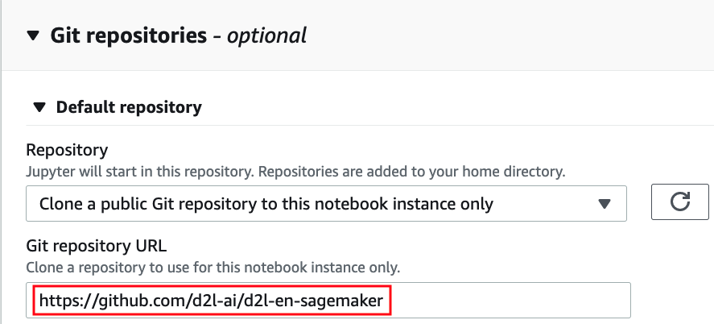

# 使用亚马逊 SageMaker
:label:`sec_sagemaker`

深度学习应用程序可能需要大量的计算资源，而这些资源很容易超出本地机器所能提供的范围云计算服务允许您使用功能更强大的计算机更轻松地运行本书的 GPU 密集型代码。本节将介绍如何使用 Amazon SageMaker 运行本书的代码。 

## 立即注册

首先，我们需要在 https://aws.amazon.com/ 注册一个账户。为了提高安全性，建议使用双因素身份验证。设置详细的账单和支出警报也是一个好主意，以避免出现任何意外，例如忘记停止运行实例时。登录 AWS 账户后，转到您的 [console](http://console.aws.amazon.com/) 并搜索 “亚马逊 SageMaker”（请参阅 :numref:`fig_sagemaker`），然后单击它以打开 SageMaker 面板。 


:width:`300px`
:label:`fig_sagemaker`

## 创建 SageMaker 实例

接下来，让我们按照 :numref:`fig_sagemaker-create` 中的说明创建一个笔记本实例。 


:width:`400px`
:label:`fig_sagemaker-create`

SageMaker 提供了多个具有不同计算能力和价格的 [instance types](https://aws.amazon.com/sagemaker/pricing/instance-types/)。创建 notebook 实例时，我们可以指定其名称和类型。在 :numref:`fig_sagemaker-create-2` 中，我们选择了 `ml.p3.2xlarge`：有了一个特斯拉 V100 GPU 和一个 8 核 CPU，这个实例对于本书的大部分内容来说都足够强大。 


:width:`400px`
:label:`fig_sagemaker-create-2`

:begin_tab:`mxnet`
可从 https://github.com/d2l-ai/d2l-en-sagemaker. We can specify this GitHub repository URL (:numref:`fig_sagemaker-create-3` 获得用于使用 SageMaker 运行的 ipynb 格式的整本书，以允许 SageMaker 在创建实例时对其进行克隆。
:end_tab:

:begin_tab:`pytorch`
可从 https://github.com/d2l-ai/d2l-pytorch-sagemaker. We can specify this GitHub repository URL (:numref:`fig_sagemaker-create-3` 获得用于使用 SageMaker 运行的 ipynb 格式的整本书，以允许 SageMaker 在创建实例时对其进行克隆。
:end_tab:

:begin_tab:`tensorflow`
可从 https://github.com/d2l-ai/d2l-tensorflow-sagemaker. We can specify this GitHub repository URL (:numref:`fig_sagemaker-create-3` 获得用于使用 SageMaker 运行的 ipynb 格式的整本书，以允许 SageMaker 在创建实例时对其进行克隆。
:end_tab:


:width:`400px`
:label:`fig_sagemaker-create-3`

## 运行和停止实例

创建实例可能需要几分钟的时间。实例准备就绪后，单击旁边的 “打开 Jupyter” 链接 (:numref:`fig_sagemaker-open`)，以便您可以在此实例上编辑和运行本书的所有 Jupyter 笔记本电脑（类似于 :numref:`sec_jupyter` 中的步骤）。 


:width:`400px`
:label:`fig_sagemaker-open`

完成工作后，不要忘记停止实例以避免进一步收费 (:numref:`fig_sagemaker-stop`)。 


:width:`300px`
:label:`fig_sagemaker-stop`

## 更新笔记本

:begin_tab:`mxnet`
这本开源书的笔记本将在 GitHub 上的 [d2l-ai/d2l-en-sagemaker](https://github.com/d2l-ai/d2l-en-sagemaker) 仓库中定期更新。要更新到最新版本，您可以在 SageMaker 实例 (:numref:`fig_sagemaker-terminal`) 上打开一个终端。
:end_tab:

:begin_tab:`pytorch`
这本开源书的笔记本将在 GitHub 上的 [d2l-ai/d2l-pytorch-sagemaker](https://github.com/d2l-ai/d2l-pytorch-sagemaker) 仓库中定期更新。要更新到最新版本，您可以在 SageMaker 实例 (:numref:`fig_sagemaker-terminal`) 上打开一个终端。
:end_tab:

:begin_tab:`tensorflow`
这本开源书的笔记本将在 GitHub 上的 [d2l-ai/d2l-tensorflow-sagemaker](https://github.com/d2l-ai/d2l-tensorflow-sagemaker) 仓库中定期更新。要更新到最新版本，您可以在 SageMaker 实例 (:numref:`fig_sagemaker-terminal`) 上打开一个终端。
:end_tab:


:width:`300px`
:label:`fig_sagemaker-terminal`

您可能希望在从远程存储库中提取更新之前提交本地更改。否则，只需在终端中使用以下命令丢弃所有本地更改即可：

:begin_tab:`mxnet`
```bash
cd SageMaker/d2l-en-sagemaker/
git reset --hard
git pull
```
:end_tab:

:begin_tab:`pytorch`
```bash
cd SageMaker/d2l-pytorch-sagemaker/
git reset --hard
git pull
```
:end_tab:

:begin_tab:`tensorflow`
```bash
cd SageMaker/d2l-tensorflow-sagemaker/
git reset --hard
git pull
```
:end_tab:

## 摘要

* 我们可以使用 Amazon SageMaker 创建一个笔记本实例来运行这本书的 GPU 密集型代码。
* 我们可以通过 Amazon SageMaker 实例上的终端更新笔记本电脑。

## 练习

1. 使用亚马逊 SageMaker 编辑和运行任何需要 GPU 的部分。
1. 打开终端以访问存放本书所有笔记本的本地目录。

[Discussions](https://discuss.d2l.ai/t/422)
